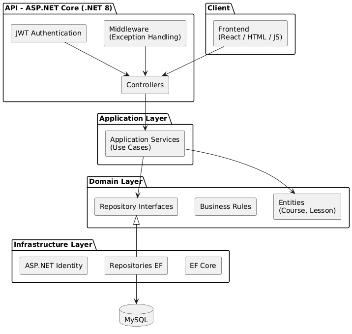

# Technical Documentation

**ProjectCore Backend**

## 1. Overview

ProjectCore Backend is a REST API developed in **.NET 8** for managing courses and lessons.


Go to [How to Use](USE.md)

The system is designed following the principles of **Clean Architecture** and **Domain-Driven Design (DDD).**

---

## 2. General Architecture

The solution strictly follows **Clean Architecture**:

```

API

└── Application

└── Domain

└── Infrastructure
```

### Dependencies

- `API` → `Application`
- `Application` → `Domain`
- `Infrastructure` → `Domain`
- **The domain does not depend on any other layer**

### Technologies



---

## 3. System Layers

### 3.1 Domain

`ProjectCore.Domain`

Responsibilities:

- Contains the **domain model**
- Defines **entities**, **business rules**, and **contract**

Examples of implemented rules:

- A course cannot be published without lessons
- The order of lessons must be unique per course
- Deletion is logical (soft delete)

---

### 3.2 Application

`ProjectCore.Application`

Responsibilities:

- Orchestrate the **use cases**
- Coordinate domain and repositories
- Does not contain business logic

Examples of services:

- `PublishCourseService`
- `CreateLessonService`
- `DeleteLessonService`
- `SearchCoursesService`

---

### 3.3 Infrastructure

`ProjectCore.Infrastructure`

Responsibilities:

- Technical Implementation
- Data Access
- Persistence
- Identity and Security

Includes:

- Entity Framework Core
- Fluent API Configuration
- EF Repositories
- ASP.NET Identity
- Migrations
- Data Seeding

### Database

- MySQL (Pomelo)
- Automatic Migrations
- Indexes and Constraints Defined from EF

---

### 3.4 API

`ProjectCore.Api`

Responsibilities:

- Exposing the REST API
- Handling HTTP
- Authentication and Authorization
- Middleware and Configuration

Includes:

- Controllers
- DTOs
- Error Middleware
- JWT Authentication
- Swagger

Controllers **do not contain business logic**.

---

## 4. Domain Model


### 4.1 Aggregate Root: Course

The `Course` is the **Aggregate Root** of the domain.


Responsibilities:

- Control the course lifecycle
- Manage lessons
- Protect business rules

Examples:

- `Publish()`
- `Unpublish()`
- `AddLesson()`
- `UpdateLesson()`
- `DeleteLesson()`
- `SoftDelete()`

---

### 4.2 Entity: Lesson

The `Lesson` entity:

- Does not exist outside of a `Course`
- Does not have its own repository
- Is managed exclusively by the aggregate

---

## 5. Persistence (EF Core)

### 5.2 Migrations

Migrations accurately reflect the domain model:

- Tables: `Courses`, `Lessons`, Identity tables
- Properly defined relationships
- Constraints aligned with business rules

---

## 6. Security

### 6.1 Authentication

- ASP.NET Identity
- JWT Bearer Authentication
- Symmetric Key Signed Tokens

Public Endpoints:

- `/api/auth/register`
- `/api/auth/login`

Protected Endpoints:

- Courses
- Lessons

---

### 6.2 Test User (Seed)

When the application starts:

- A user is automatically created if it doesn't exist
- Allows testing the API without manual configuration

---

## 7. Error Handling

The system uses a global exception middleware that:

- Centralizes error handling
- Prevents stack traces in production
- Returns consistent JSON responses

Example response:

```json
{
"status":400,
"error":"Course not"} found"
}
```

---

## 8. Testing

### 8.1 Approach

- Domain unit tests
- No EF Core dependencies
- No unnecessary mocks
- Quick and deterministic tests

---

### 8.2 Tested Rules

- Course publishing
- Unique lesson order
- Soft delete
- Aggregate behavior

Frameworks:

- xUnit
- FluentAssertions

---

## 10. Project Status

The backend is:

- A functional REST API project, with complete use cases, ready to be consumed by a frontend.

---

# Functional Documentation

**ProjectCore Backend**

## 1. Purpose

This document describes **how to run, configure, and use** the ProjectCore backend.

It is intended for:

- Technical testers
- Developers cloning the repository
- Frontend integration

It does not explain the internal architecture (See the technical documentation [README.md]).

---

## 2. Prerequisites

Before running the project, make sure you have the following installed:

- .NET SDK 8.0
- MySQL 8.x
- Git
- A database management system (MySQL Workbench, DBeaver, etc.)

---

## 3. Repository Structure

```

ProjectCore.Backend
├── src
│ ├── ProjectCore.Api
│ ├── ProjectCore.Application
│ ├── ProjectCore.Domain
│ ├── ProjectCore.Domain.Tests
│ └── ProjectCore.Infrastructure
└── README / Documentation
```

---

## 4. Initial Configuration

### 4.1 Database

Create an empty MySQL database:

```sql
CREATE DATABASE projectcore_db;
```

---

### 4.2 Connection String

Edit the file:

```
ProjectCore.Api/appsettings.json
```

Example:

```json
"ConnectionStrings":{
"DefaultConnection ":"server=localhost;port=3306;database=projectcore_db;user=root;password=123456"
}
```

Adjust `user` and `password` according to your local environment.

---

### 4.3 JWT Configuration

In the same file:

```json
"Jwt":{
"Key: A4ZNZ3gSDDWQ2CuEatNvIgRz1hK4nZNmIIcoi4R2",
"Issuer: ProjectCore",
"Audience: ProjectCoreUsers",
"ExpiresInMinutes": 60
}
```

> Note: In a real-world environment, this key must be stored securely.

` ...
`````
`````
`````
`````
`````
`````
````
````
````
````
``` >

---

## 5. Migrations and Database

From the `src` folder, run:

```bash
dotnet ef database update \
--project ProjectCore.Infrastructure \
--startup-project ProjectCore.Api
```

This will:

- Create the tables
- Apply relationships
- Configure Identity
- Leave the database ready to use

---

## 6. Run the API

From the `src` folder:

```bash
dotnet run --project ProjectCore.Api
```

The API will typically start at:

```
http://localhost:5000
https://localhost:5001
```

(or the port specified by the console).

---

## 7. Swagger (Manual Testing)

Access:

```
https://localhost:{port}/swagger
```

From Swagger, you can test **all endpoints** without external tools.

---

## 8. Test User (Seed)

When the API starts, a user is automatically created if it doesn't already exist:

```
Email: admin@projectcore.com
Password: Admin123!

``` ```

This user is used for:

- Login
- Obtaining JWTs
- Consuming protected endpoints

---

## 9. Authentication (JWT)

### 9.1 Login

Endpoint:

```
POST /api/auth/login
```

Body:

```json
{
"email: admin@projectcore.com",
"password: Admin123!"

``` }
```

Answer:

```json
{
"token:eyJhbGciOiJIUzI1NiIsInR5cCI6IkpXVCJ9..."
}
```

---

### 9.2 Using the Token

In Swagger:

1. Copy the token
2. Click on **Authorize**
3. Type:

```
Bearer {token}
```

This enables protected endpoints.

---

## 10. Available Endpoints

### 10.1 Courses

| Method | Endpoint | Description |

--- | --- | --- | ---

| GET | `/api/courses/search` | List courses with filters |

| PATCH | `/api/courses/{id}/publish` | Publish course |

| PATCH | `/api/courses/{id}/unpublish` | Unpublish course |

Search parameters:

- `q`: text
- `status`: Draft / Published
- `page`
- `pageSize`

---

### 10.2 Lessons

| Method | Endpoint | Description |

| --- | --- | --- |

| POST | `/api/courses/{courseId}/lessons` | Create lesson |

| PUT | `/api/courses/{courseId}/lessons/{lessonId}` | Edit lesson |

| DELETE | `/api/courses/{courseId}/lessons/{lessonId}` | Delete lesson (soft delete) |

Example body:

```json
{
"title":"Introduction",
"order":1
}
```

---

## 11. Important Functional Rules

- A course **cannot be published** without active lessons
- The `order` field of lessons must be unique per course
- Deletions are **logical**, not physical
- Reordering does not allow duplicates
- Errors are returned as clear JSON

Example error:

```json
{
"status":400,
"error":"Course not found"
}
```

---

## 12. Run Tests

From the `src` folder:

```bash
dotnettest ProjectCore.Domain.Tests
```

The tests validate:

- Business rules
- Domain consistency
- Behavior of the Added

---

## 13. Typical Functional Flow

1. Log in and obtain JWT
2. Create course (if an endpoint is implemented)
3. Create lessons
4. Publish course
5. List courses
6. Edit/delete lessons
7. Unpublish course


---

## 14. Project Status

The system is:

- Functional
- Tested
- Documented
- Frontend ready

---

## 15. Final Notes

- The backend is independent of the frontend
- Rules reside in the domain
- The API is stable and predictable

---