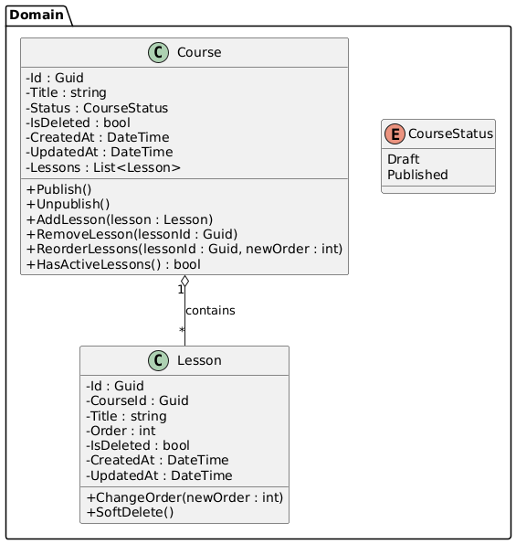

# Documentación Técnica

**ProjectCore Backend**

## 1. Visión General

ProjectCore Backend es una API REST desarrollada en **.NET 8** para la gestión de cursos y lecciones.

Ir a [Como Usar](USE.md)

El sistema está diseñado siguiendo principios de **Clean Architecture** y **Domain-Driven Design (DDD).**

---

## 2. Arquitectura General

La solución sigue estrictamente **Clean Architecture**:

```
API
 └── Application
      └── Domain
           └── Infrastructure
```

### Dependencias

- `API` → `Application`
- `Application` → `Domain`
- `Infrastructure` → `Domain`
- **El dominio no depende de ninguna otra capa**

### Tecnologias


---

## 3. Capas del Sistema


### 3.1 Domain

`ProjectCore.Domain`

Responsabilidad:

- Contiene el **modelo de dominio**
- Define **entidades**, **reglas de negocio** y **contrato**

Ejemplo de reglas implementadas:

- Un curso no puede publicarse sin lecciones
- El orden de las lecciones debe ser único por curso
- La eliminación es lógica (soft delete)

---

### 3.2 Application

`ProjectCore.Application`

Responsabilidad:

- Orquestar los **casos de uso**
- Coordinar dominio y repositorios
- No contiene lógica de negocio

Ejemplos de servicios:

- `PublishCourseService`
- `CreateLessonService`
- `DeleteLessonService`
- `SearchCoursesService`

---

### 3.3 Infrastructure

`ProjectCore.Infrastructure`

Responsabilidad:

- Implementación técnica
- Acceso a datos
- Persistencia
- Identity y seguridad

Incluye:

- Entity Framework Core
- Configuración Fluent API
- Repositorios EF
- ASP.NET Identity
- Migraciones
- Seed de datos

### Base de datos

- MySQL (Pomelo)
- Migraciones automáticas
- Índices y constraints definidos desde EF

---

### 3.4 API

`ProjectCore.Api`

Responsabilidad:

- Exponer la API REST
- Manejar HTTP
- Autenticación y autorización
- Middleware y configuración

Incluye:

- Controllers
- DTOs
- Middleware de errores
- JWT Authentication
- Swagger

Los controllers **no contienen lógica de negocio**.

---

## 4. Modelo de Dominio



### 4.1 Aggregate Root: Course

El `Course` es el **Aggregate Root** del dominio.

Responsabilidades:

- Controlar el ciclo de vida del curso
- Administrar las lecciones
- Proteger las reglas de negocio

Ejemplos:

- `Publish()`
- `Unpublish()`
- `AddLesson()`
- `UpdateLesson()`
- `DeleteLesson()`
- `SoftDelete()`

---

### 4.2 Entidad: Lesson

La entidad `Lesson`:

- No existe fuera de un `Course`
- No tiene repositorio propio
- Es gestionada exclusivamente por el agregado

---

## 5. Persistencia (EF Core)

### 5.2 Migraciones

Las migraciones reflejan fielmente el modelo de dominio:

- Tablas: `Courses`, `Lessons`, tablas de Identity
- Relaciones correctamente definidas
- Constraints alineados con reglas de negocio

---

## 6. Seguridad

### 6.1 Autenticación

- ASP.NET Identity
- JWT Bearer Authentication
- Tokens firmados con clave simétrica

Endpoints públicos:

- `/api/auth/register`
- `/api/auth/login`

Endpoints protegidos:

- Cursos
- Lecciones

---

### 6.2 Usuario de prueba (Seed)

Al iniciar la aplicación:

- Se crea automáticamente un usuario si no existe
- Permite probar la API sin configuración manual

---

## 7. Manejo de Errores

El sistema utiliza un **middleware global de excepciones** que:

- Centraliza el manejo de errores
- Evita stack traces en producción
- Devuelve respuestas JSON consistentes

Ejemplo de respuesta:

```json
{
"status":400,
"error":"Course not found"
}
```

---

## 8. Testing

### 8.1 Enfoque

- Tests unitarios de dominio
- Sin dependencias de EF Core
- Sin mocks innecesarios
- Tests rápidos y deterministas

---

### 8.2 Reglas testeadas

- Publicación de cursos
- Orden único de lecciones
- Soft delete
- Comportamiento del agregado

Frameworks:

- xUnit
- FluentAssertions

---

## 10. Estado del Proyecto

El backend se encuentra:

- Proyecto API REST funcional, con sus casos de uso completos, Lista para consumir en un FrontEnd.
