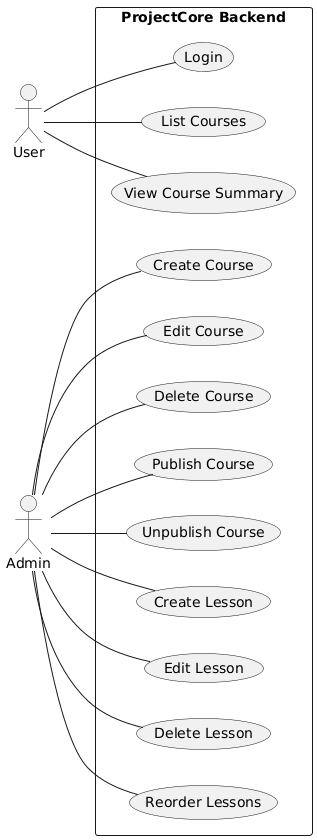

# Documentación Funcional

**ProjectCore Backend**

## 1. Propósito

Este documento describe **cómo ejecutar, configurar y utilizar** el backend de ProjectCore.

Está orientado a:

- Evaluadores técnicos
- Desarrolladores que clonen el repositorio
- Integración con frontend

No explica arquitectura interna ( Ir a [la documentación técnica](README.md) ).


---

## 2. Requisitos Previos

Antes de ejecutar el proyecto, asegúrate de tener instalado:

- **.NET SDK 8.0**
- **MySQL 8.x**
- **Git**
- Un gestor de base de datos (MySQL Workbench, DBeaver, etc.)

---

## 3. Estructura del Repositorio

```
ProjectCore.Backend
 ├── src
 │   ├── ProjectCore.Api
 │   ├── ProjectCore.Application
 │   ├── ProjectCore.Domain
 │   ├── ProjectCore.Domain.Tests
 │   └── ProjectCore.Infrastructure
 └── README / documentación
```

---

## 4. Configuración Inicial

### 4.1 Base de Datos

Crear una base de datos MySQL vacía:

```sql
CREATE DATABASE projectcore_db;
```

---

### 4.2 Connection String

Editar el archivo:

```
ProjectCore.Api/appsettings.json
```

Ejemplo:

```json
"ConnectionStrings":{
"DefaultConnection":"server=localhost;port=3306;database=projectcore_db;user=root;password=123456"
}
```

Ajusta `user` y `password` según tu entorno local.

---

### 4.3 Configuración JWT

En el mismo archivo:

```json
"Jwt":{
"Key":"A4ZNZ3gSDDWQ2CuEatNvIgRz1hK4nZNmIIcoi4R2",
"Issuer":"ProjectCore",
"Audience":"ProjectCoreUsers",
"ExpiresInMinutes":60
}
```

> Nota: En un entorno real esta clave debe almacenarse de forma segura.
>

---

## 5. Migraciones y Base de Datos

Desde la carpeta `src` ejecutar:

```bash
dotnet ef database update \
  --project ProjectCore.Infrastructure \
  --startup-project ProjectCore.Api
```

Esto:

- Crea las tablas
- Aplica relaciones
- Configura Identity
- Deja la base lista para usar

---

## 6. Ejecutar la API

Desde la carpeta `src`:

```bash
dotnet run --project ProjectCore.Api
```

La API se levantará normalmente en:

```
http://localhost:5000
https://localhost:5001
```

(o el puerto indicado por consola).

---

## 7. Swagger (Pruebas Manuales)

Acceder a:

```
https://localhost:{puerto}/swagger
```

Desde Swagger se pueden probar **todos los endpoints** sin herramientas externas.

---

## 8. Usuario de Prueba (Seed)

Al iniciar la API, se crea automáticamente un usuario si no existe:

```
Email: admin@projectcore.com
Password: Admin123!
```

Este usuario se utiliza para:

- Login
- Obtener JWT
- Consumir endpoints protegidos

---

## 9. Autenticación (JWT)

### 9.1 Login

Endpoint:

```
POST /api/auth/login
```

Body:

```json
{
"email":"admin@projectcore.com",
"password":"Admin123!"
}
```

Respuesta:

```json
{
"token":"eyJhbGciOiJIUzI1NiIsInR5cCI6IkpXVCJ9..."
}
```

---

### 9.2 Usar el Token

En Swagger:

1. Copiar el token
2. Click en **Authorize**
3. Escribir:

```
Bearer {token}
```

Esto habilita los endpoints protegidos.

---

## 10. Endpoints Disponibles

### 10.1 Cursos

| Método | Endpoint | Descripción |
| --- | --- | --- |
| GET | `/api/courses/search` | Listar cursos con filtros |
| PATCH | `/api/courses/{id}/publish` | Publicar curso |
| PATCH | `/api/courses/{id}/unpublish` | Despublicar curso |

Parámetros de búsqueda:

- `q`: texto
- `status`: Draft / Published
- `page`
- `pageSize`

---

### 10.2 Lecciones

| Método | Endpoint | Descripción |
| --- | --- | --- |
| POST | `/api/courses/{courseId}/lessons` | Crear lección |
| PUT | `/api/courses/{courseId}/lessons/{lessonId}` | Editar lección |
| DELETE | `/api/courses/{courseId}/lessons/{lessonId}` | Eliminar lección (soft delete) |

Body ejemplo:

```json
{
"title":"Introducción",
"order":1
}
```

---

## 11. Reglas Funcionales Importantes

- Un curso **no puede publicarse** sin lecciones activas
- El campo `order` de las lecciones debe ser único por curso
- Las eliminaciones son **lógicas**, no físicas
- El reordenamiento no permite duplicados
- Los errores se devuelven como JSON claro

Ejemplo de error:

```json
{
"status":400,
"error":"Course not found"
}
```

---

## 12. Ejecutar Tests

Desde la carpeta `src`:

```bash
dotnettest ProjectCore.Domain.Tests
```

Los tests validan:

- Reglas de negocio
- Consistencia del dominio
- Comportamiento del agregado

---

## 13. Flujo Funcional Típico

1. Login y obtener JWT
2. Crear curso (si se implementa endpoint)
3. Crear lecciones
4. Publicar curso
5. Listar cursos
6. Editar / eliminar lecciones
7. Despublicar curso



---

## 14. Estado del Proyecto

El sistema está:

- Funcional
- Probado
- Documentado
- Preparado para frontend

---

## 15. Notas Finales

- El backend no depende del frontend
- Las reglas viven en el dominio
- La API es estable y predecible

---